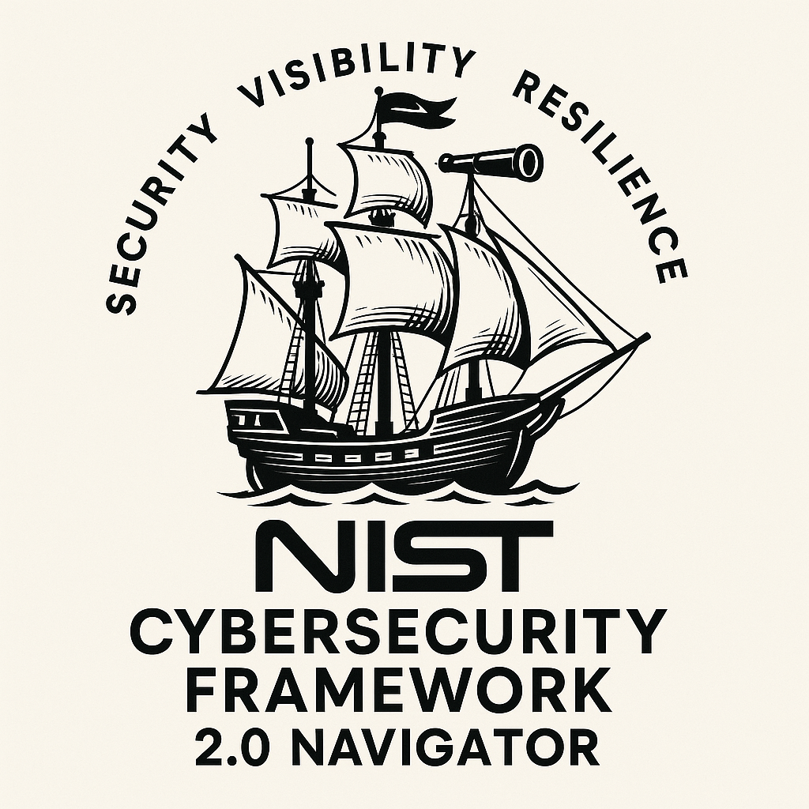

# NistNavigator


🛡️ NistNavigator - Your guide through NIST CSF 2.0 💼 People | 📋 Process | 💻 Technology | 💰 Investment levels

**Visualiseur interactif du NIST Cybersecurity Framework 2.0**

Explorez les subcatégories du framework NIST CSF 2.0 avec une analyse granulaire par **People**, **Process**, et **Technology**, accompagnée des niveaux d'investissement (CAPEX/OPEX) requis pour chaque contrôle.

---

## 🎯 Caractéristiques

✨ **Exploration interactive par subcatégorie**
- Filtrage par Fonction (GV, ID, PR, DE, RS, RC)
- Filtrage intelligent par Catégorie (mise à jour dynamique selon la fonction sélectionnée)
- Affichage complet de 46 subcatégories du NIST CSF 2.0

👥 **Analyse 3 piliers**
- **People** : Rôles et responsabilités impliqués
- **Process** : Processus et procédures à mettre en place
- **Technology** : Solutions et outils technologiques

💰 **Évaluation des investissements**
- Niveaux CAPEX (Minimal, Faible, Moyen, Élevé)
- Niveaux OPEX (Minimal, Faible, Moyen, Élevé)
- Vue d'ensemble pour la planification budgétaire

📊 **Interface intuitive**
- Design moderne et responsive
- Tableau scrollable avec en-têtes fixes
- Badges colorés pour une lecture rapide
- Statistiques en temps réel

---

## 🚀 Utilisation

### Accès rapide
1. Ouvrez le fichier `index.html` dans votre navigateur
2. Aucune installation requise - application web 100% client-side

### Guide d'utilisation

**Filtrer par Fonction :**
- Sélectionnez une fonction dans le menu déroulant "Fonction"
- Les catégories disponibles se mettent à jour automatiquement

**Filtrer par Catégorie :**
- Choisissez une catégorie spécifique
- Le tableau affiche uniquement les subcatégories correspondantes

**Consulter les détails :**
- Chaque ligne représente une subcatégorie unique
- Lisez la description, les équipes impliquées, les processus et technologies
- Consultez les niveaux d'investissement (CAPEX/OPEX)

---

## 📋 Structure des données

### Fonctions (6)
- **GV** - Govern (Gouvernance)
- **ID** - Identify (Identifier)
- **PR** - Protect (Protéger)
- **DE** - Detect (Détecter)
- **RS** - Respond (Répondre)
- **RC** - Recover (Récupérer)

### Exemple de subcatégorie
```javascript
{
  func: "GV",
  cat: "GV.OC",
  sub: "GV.OC-01",
  desc: "The organizational mission is understood and informs cybersecurity risk management",
  people: ["Directeurs", "Responsables cyber"],
  process: ["Définir mission", "Alignement stratégique"],
  tech: ["Outils stratégie", "Documentation"],
  capex: "Faible",
  opex: "Minimal"
}
```

---

## 🎨 Niveaux d'investissement

| Niveau | Description |
|--------|-------------|
| **Minimal** | Faible investissement initial, peu de maintenance |
| **Faible** | Investissement limité, effort modéré |
| **Moyen** | Investissement modéré, ressources nécessaires |
| **Élevé** | Investissement significatif, infrastructure complète |

---

## 💡 Cas d'usage

✅ **Pour les CISO** - Planifier les investissements en sécurité
✅ **Pour les Risk Managers** - Analyser les contrôles par dimension
✅ **Pour les Auditeurs** - Vérifier la couverture du framework
✅ **Pour les Architectes** - Dimensionner les solutions technologiques
✅ **Pour les Équipes RH** - Identifier les rôles et responsabilités

---

## 🛠️ Technologie

- **Frontend** : HTML5, CSS3, JavaScript vanilla
- **Architecture** : Client-side uniquement (pas de serveur)
- **Compatibilité** : Tous les navigateurs modernes
- **Performance** : Chargement instantané

---

## 📦 Contenu inclus

- `index.html` - Application complète (tout-en-un)
- 46 subcatégories du NIST CSF 2.0
- Données People/Process/Technology pour chaque contrôle
- Évaluations CAPEX/OPEX

---

## 🌍 Langue

- **Interface** : Français
- **Descriptions** : Anglais (spécifications NIST)
- **Données détaillées** : Français pour People/Process/Technology

---

## 📚 Ressources

- [NIST Cybersecurity Framework 2.0](https://www.nist.gov/cyberframework)
- [Documentation NIST CSF](https://csrc.nist.gov/)

---

## 💬 Contribution

Les contributions sont les bienvenues ! Vous pouvez :
- Ajouter des commentaires ou des notes pour chaque subcatégorie
- Améliorer les descriptions People/Process/Technology
- Ajouter des estimations d'investissement plus précises
- Corriger ou améliorer les traductions

---

## 📄 Licence

Ce projet est fourni à titre éducatif et de conformité.

---

## 👤 Auteur

Créé pour simplifier la navigation et la compréhension du NIST CSF 2.0

---

**Avec ❤️ pour la cybersécurité**
